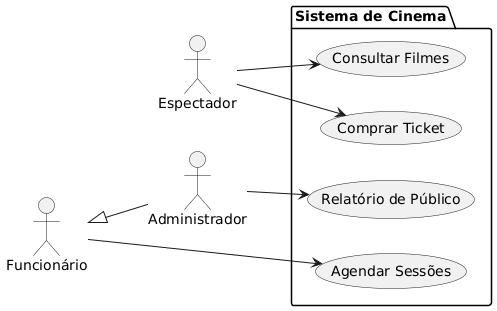
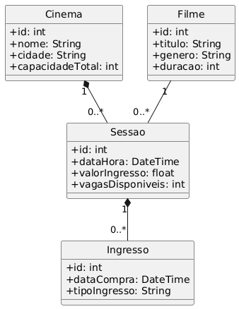
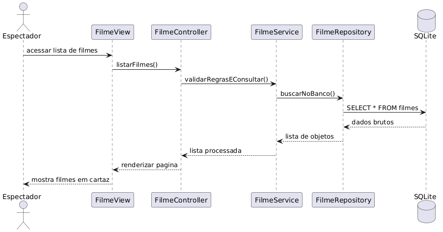

# 🎬 Sistema de Rede de Cinemas

Projeto enxuto para a aula de Engenharia de Software.

## 🚀 Requisitos e Regras
- **RF01:** Consultar filmes e sessões.
- **RF02:** Comprar ingressos.
- **RF03:** Cadastro de filmes/sessões (Funcionário).
- **RN01:** Intervalo de 20min entre sessões.
- **RN02:** Respeitar capacidade máxima da sala.

## 📊 Diagramas do Sistema

### 1. Casos de Uso

### 2. Classes de Domínio

### 3. Diagrama de Sequência (Arquitetura MVC)

## 🛠️ Implementação
O sistema utiliza **Python** com **SQLite** seguindo as camadas:
`View -> Controller -> Service -> Repository`
